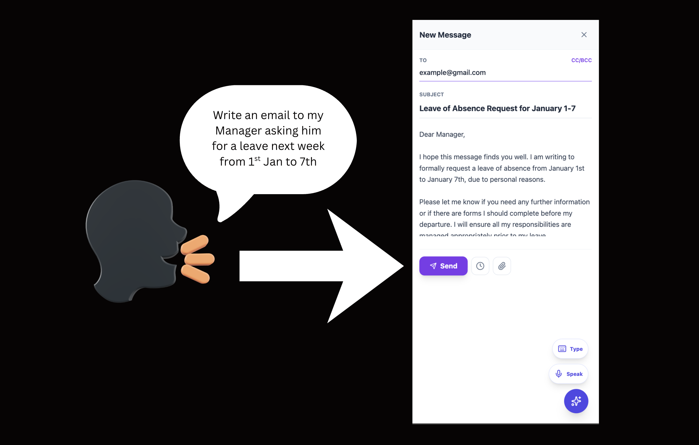
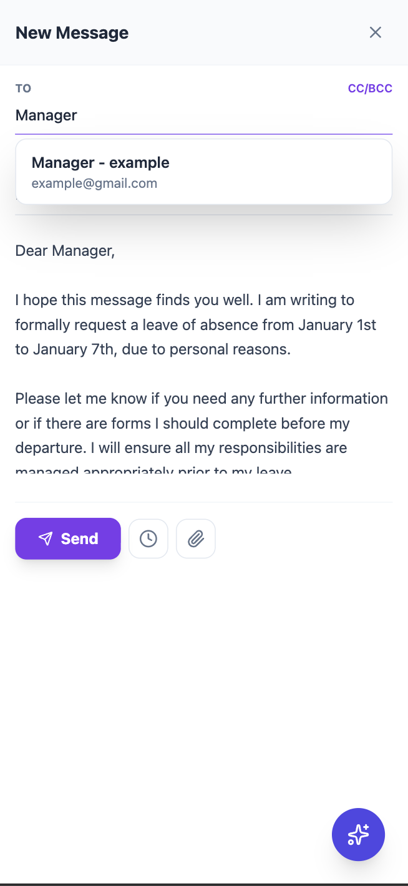
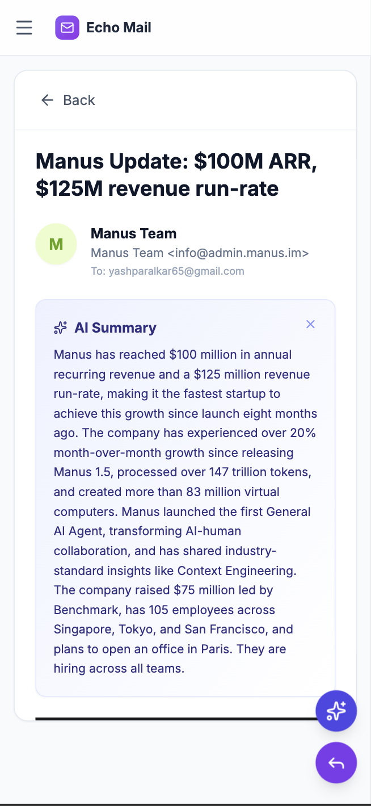
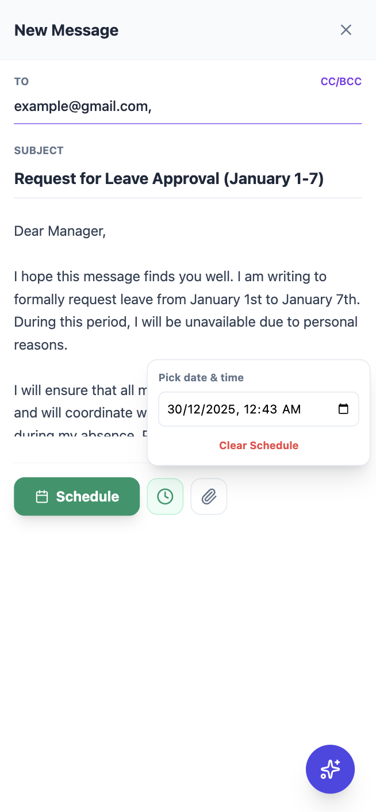

# Echo Mail – Audio-Based Email Assistant

Echo Mail is a real-time, voice-driven email platform that enables users to compose, edit, and manage emails using natural speech. The system supports conversational interaction, flexible workflows, email summarization, and AI-powered personalization based on recipient relationships.

Access the application here: https://auag-assistant.vercel.app/

**Note on Google Permissions:**
Since this is an academic project involving AI email summarization, it requires read-access to your inbox (`gmail.readonly`). As a result, Google will display an "Unverified App" warning during login.

**To bypass this:**
1. Click the "Sign in with Google" button.
2. On the warning screen, click **Advanced** (bottom left).
3. Select **Go to auag.onrender.com (unsafe)**.
4. Type "Continue" to grant the AI agent access.

*Rest assured, your data is processed in real-time and never stored permanently. You can revoke access at any time via your Google Account settings.*


---

## Features

* Voice-first email composition using real-time speech interaction
* Flexible workflow (recipient, subject, and body can be provided in any order)
* Conversational generation and iterative refinement of email content
* Smart recipient disambiguation when multiple matches exist
* AI-powered email summarization for incoming messages
* Relationship-aware personalization that adapts tone and context over time
* Live UI updates reflecting all changes
* Schedule emails to be sent at a specified date and time

---


## Screenshots

<table>
  <tr>
    <td colspan="3" align="center">
      
    </td>
  </tr>
  <tr>
    <td align="center">
      
    </td>
    <td align="center">
      
    </td>
    <td align="center">
      
    </td>
  </tr>
</table>

---

## Project Structure

```
AuAg - Assistant/
├── backend/
│   ├── app.py
│   └── ...
├── frontend/
│   ├── src/
│   ├── public/
│   └── package.json
├── .gitignore
└── README.md
```

---

## Tech Stack

### Backend

* Python
* Speech processing and conversational agent logic - AssemblyAI
* Email generation, summarization, and delivery - OpenAI API
* Relationship memory and personalization logic

### Frontend

* React
* Real-time UI for email composition and review
* Voice interaction interface
* Email summary and edit visualization

---

## Setup Instructions

### Prerequisites

* Python 3.9+
* Node.js and npm
* Virtual environment (recommended)

---

## Backend Setup

```bash
cd backend
python -m venv venv
source venv/bin/activate
pip install -r requirements.txt
```

Run the backend from the project root:

```bash
python -m backend.app
```

---

## Frontend Setup

```bash
cd frontend
npm install
npm start
```

For a production build:

```bash
npm run build
```

---

## Environment Variables & Credentials

This project requires external credentials that must **not** be committed to Git.

Create a `.env` file in the backend directory.

### Google Console (OAuth / API Credentials)

1. Go to **Google Cloud Console**
   [https://console.cloud.google.com/](https://console.cloud.google.com/)

2. Create or select a project.

3. Enable required APIs (Gmail API and People API).

4. Navigate to:
   **APIs & Services → Credentials**

5. Create an **OAuth Client ID**.

6. Download the credentials JSON and extract:

   * Client ID
   * Client Secret

---

### AssemblyAI API Key

AssemblyAI is used for speech-to-text processing.

1. Log in at:
   [https://www.assemblyai.com/](https://www.assemblyai.com/)

2. Copy your **API Key** from the dashboard.

3. Add it to `backend/.env`:

```env
ASSEMBLYAI_API_KEY=your_assemblyai_api_key
```

---

### OpenAI API Key

OpenAI is used for language understanding, email generation, summarization, and personalization.

Add your API key to `backend/.env`:

```env
OPENAI_API_KEY=your_openai_api_key
```


---

## How It Works

1. The user speaks to the agent.
2. The agent extracts intent (recipient, subject, body, edits, or summary request).
3. Email content is generated, summarized, or updated.
4. Recipient relationship context is applied when available.
5. Changes are reflected instantly in the frontend.
6. The user confirms the final email.
7. The email is sent.

---

## Use Cases

* Hands-free email composition
* Email summarization and review
* Relationship-aware professional communication
* Accessibility-focused workflows
* Voice-first productivity tools
* Scheduled emails

---

## License

This project is licensed under the MIT License.

---
